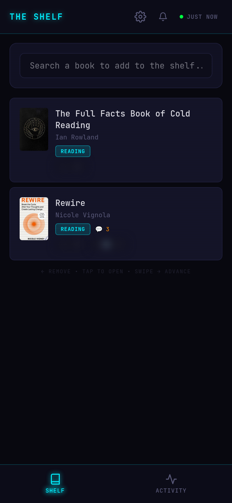
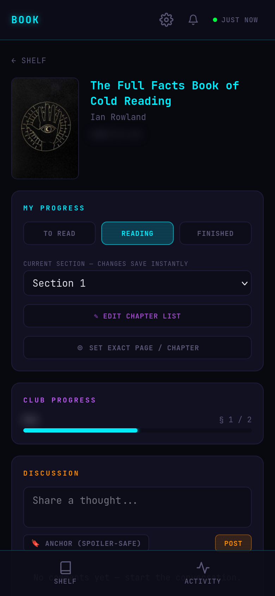
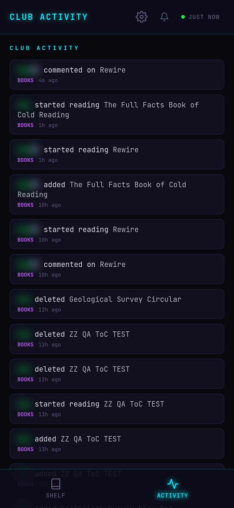
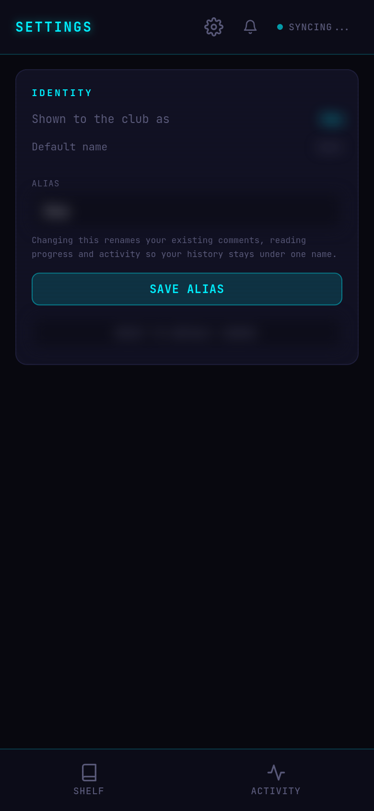

# BookClub

<div align="center">


**A cyberpunk-themed mobile-first PWA for a shared reading club.**

*One shelf, many readers — track your own progress and discuss without spoilers.*

*Rust + Dioxus 0.7 + Tailwind CSS v4 + SQLite*

</div>

---

## Screenshots

<div align="center">
<table>
<tr>
<td align="center"><br/><b>The Shelf</b></td>
<td align="center"><br/><b>Book &amp; Progress</b></td>
</tr>
<tr>
<td align="center"><br/><b>Club Activity</b></td>
<td align="center"><br/><b>Identity / Alias</b></td>
</tr>
</table>
</div>

## What it is

A small group reads the same books. BookClub is a single **shared shelf**: everyone
sees the same list, but each member tracks **their own** reading progress on each
book and discusses it with **spoiler-aware** comments.

## Features

- **Shared shelf** — add books by searching Google Books (cover, author, page count
  auto-filled); the shelf is shared by the whole club, de-duplicated by Google Books ID.
- **Per-reader progress** — each member has their own status (To Read / Reading /
  Finished) and position on the same book.
- **Section-based progress** — a "Current section" dropdown driven by the book's
  table of contents; picking a section **saves instantly**. The progress bar and
  shelf percentages are chapter/section-based (falling back to pages when there is
  no ToC).
- **Table of contents** — fetched from Open Library by ISBN, editable by hand, or
  scanned from a photo of the contents page via OCR (Tesseract).
- **Spoiler-safe discussion** — comments can be anchored to a page/chapter. The
  server **blanks** any comment whose anchor is ahead of *your* progress until you
  catch up. Newest comments first, with a filter by commenter.
- **Club activity feed** — who added / started / finished / commented, in real time.
- **Identity & aliases** — pick the name the club sees; changing it coherently
  rewrites your existing comments, progress and activity so your history stays
  under one name.
- **Offline-first PWA** — installable, with a localStorage cache so the shelf and
  opened books still work without a connection.
- **Web push notifications** — optional, via VAPID.
- **Cyberpunk UI** — neon-on-dark, JetBrains Mono, scanline overlay, swipe gestures.

## Stack

| Layer | Technology |
|-------|-----------|
| Language | Rust (2021 edition) |
| Frontend | Dioxus 0.7 (fullstack, compiles to WebAssembly) |
| Server | Axum server functions (`#[server]`) |
| Styling | Tailwind CSS v4 with a custom cyberpunk theme |
| Database | SQLite with r2d2 connection pooling (WAL) |
| Book data | Google Books (search) + Open Library (table of contents) |
| OCR | Tesseract — scan a contents page into a chapter list |
| Auth | Tailscale user headers (shared club user + per-reader identity) |

## Build & Dev

```bash
./scripts/dev.sh      # Tailwind watch + Dioxus dev server (port 8080)
./scripts/build.sh    # Production build -> target/dx/bookclub/release/web/
./scripts/check.sh    # cargo check
./scripts/deploy.sh   # Build + Docker + deploy + health check
```

## Deployment

Docker Compose with a Tailscale sidecar (`hostname: bookclub`). The Dockerfile
copies the locally-built `bookclub` binary into a slim Debian image (no Rust
toolchain in the image). SQLite lives in a Docker volume.

| Env var | Purpose |
|---------|---------|
| `DATABASE_PATH` | SQLite location (default `bookclub.db`) |
| `REQUIRE_AUTH` | Require the Tailscale identity header when `true` |
| `GOOGLE_BOOKS_API_KEY` | **Required.** Google now caps the keyless Books API at 0 queries/day, so without it book search and the Google-Books ToC fallback both fail. Make one in a Google Cloud project with Books API enabled. |
| `VAPID_PUBLIC_KEY` / `VAPID_PRIVATE_KEY` | Enable web-push notifications |

## License

Private project — not licensed for redistribution.
